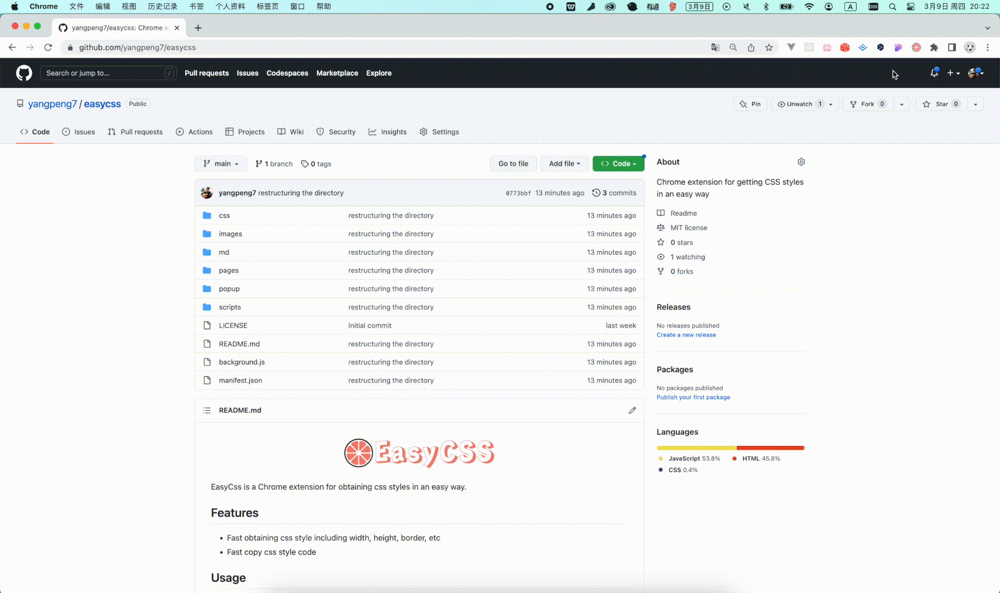

  

EasyCss is a Chrome extension for obtaining css styles in an easy way.
## Features

- Inspect the styles of any element
- Fast obtaining css style including width, height, border, etc
- Fast copy css style code

## Usage

## Install

### Install from Google Extension Store

### Load from local source code

### Install from crx